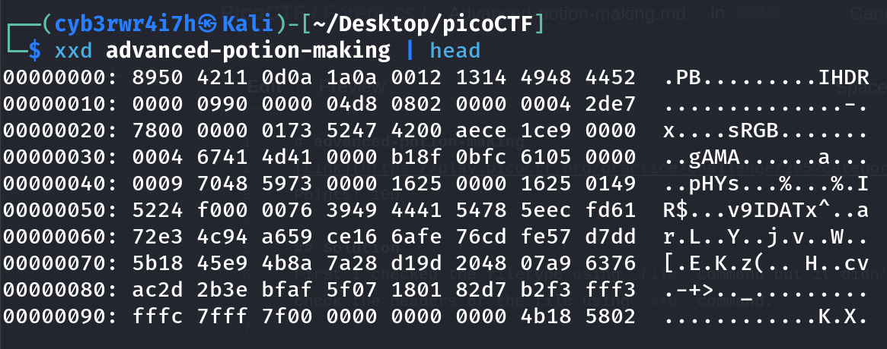
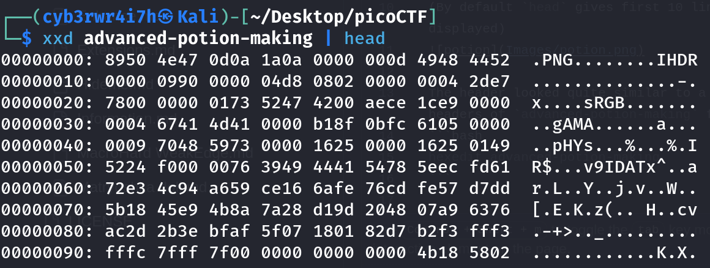

# advanced-potion-making
[Link](https://play.picoctf.org/practice/challenge/205?category=4&page=1) for this challenge

Points: 100

## Writeup
First I checked the filetype using `file` command but it didn't tell much so I decided to check the headers of the file using `xxd` command.
```bash
xxd advanced-potion-making | head
```
(By default `head` gives first 10 lines but we can also give the number of lines to be displayed)


The header looked quite similar to a PNG file header but not exactly so I changed the headers of `advanced-potion-making` file to that of a PNG file using
```bash
hexedit advanced-potion-making
```


Then I viewed the file using
```bash
nsxiv advanced-potion-making
```
Then the image I found was completely red so I did a Google Search about image stegonography and found a [website](https://incoherency.co.uk/image-steganography/#unhide). Then I uploaded the image and found the flag.

## Flag
picoCTF{w1z4rdry}
