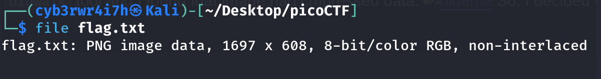

# Extensions
[Link](https://play.picoctf.org/practice/challenge/52?category=4&page=3)
Points: 150

## Solution

First I checked the file type using `file` command
```bash
file flag.txt
```


Since it's an image, I opened it using `nsxiv` command
```bash
nsxiv flag.txt
```


It contains the flag.

## Flag
picoCTF{now_you_know_about_extensions}
