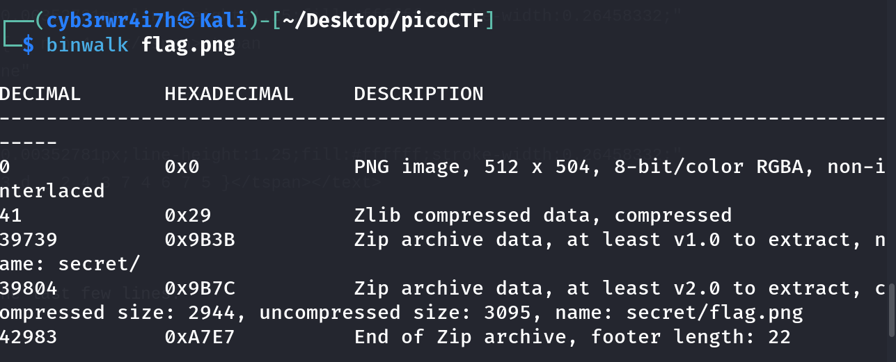

# Hideme
[Link](https://play.picoctf.org/practice/challenge/350?category=4&page=2) for challenge

Points: 100

## Solution

To investigate the image, I tried `binwalk` tool and I found that image had cmpressed data.


So, I decided to unzip it using `unzip` command
```bash
unzip flag.png
```


Then in `secret` directory, there was an image named `Flag.png` which contained the flag.


## Flag
picoCTF{Hiddinng_An_imag3_within_@n_ima9e_ad9f6587}
