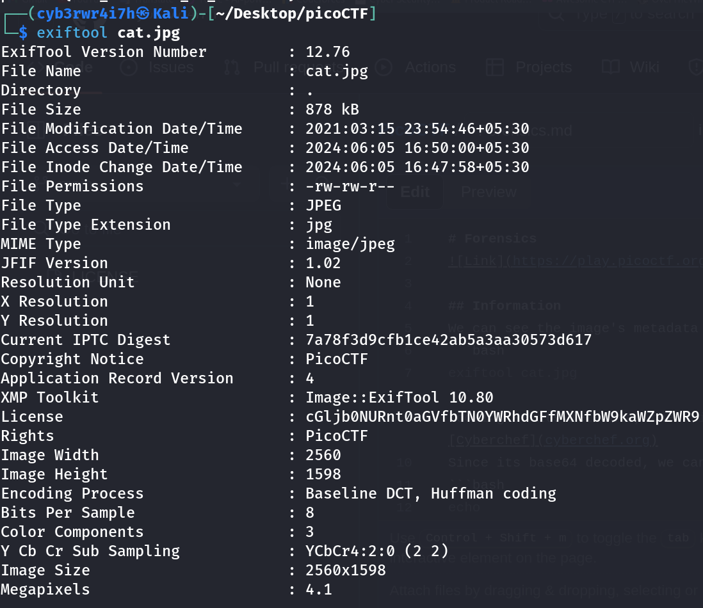

# Information
[Link](https://play.picoctf.org/practice?category=4&page=1) for challenge
Points: 10

## Solution
To see the image's details, I decided to see the image's metadata using `exiftool` as:
```bash
exiftool cat.jpg
```
It gave: 
  
  
Looking at its metadata, the `License` string looks different so I decoded it using [Cyberchef](cyberchef.org)
Since its base64 encoded, we can also decode it using
```bash
echo cGljb0NURnt0aGVfbTN0YWRhdGFfMXNfbW9kaWZpZWR9 | basee64 -d
```
## Flag
picoCTF{the_m3tadata_1s_modified} 
