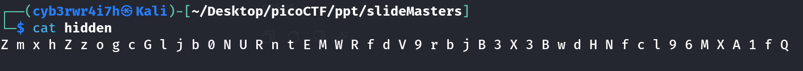

# MacroHard WeakEdge
[Link](https://play.picoctf.org/practice/challenge/130?category=4&page=1) for this challenge

Points: 60

## Solution
When I tried the `binwalk` command on `Forensics is fun.pptm`, I found out that it contains zipped data so I unzipped it using `unzip` command.
```bash
unzip Forensics\ is\ fun.pptm 
```

Then I navigated through extracted directories and found `hidden` file in `ppt/slideMasters/`. Using `cat` command, I printed it's content


This looked like an encrypted text so I joined it formed a string. Then I tried to decode it using base64

```bash
 echo  ZmxhZzogcGljb0NURntEMWRfdV9rbjB3X3BwdHNfcl96MXA1fQ  | base64 -d 
```
This gave the flag.

## Flag
picoCTF{D1d_u_kn0w_ppts_r_z1p5}
