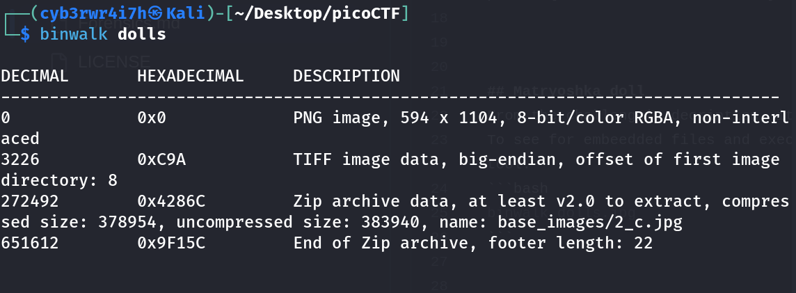
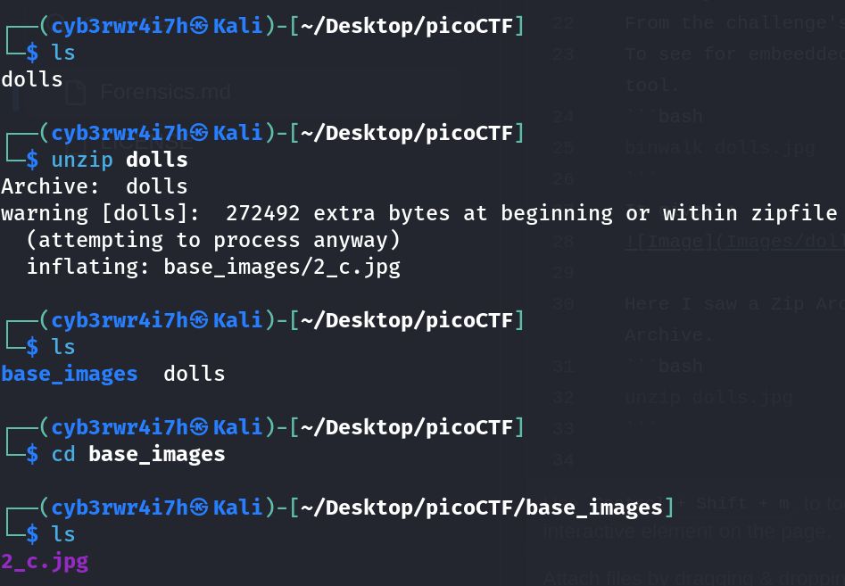
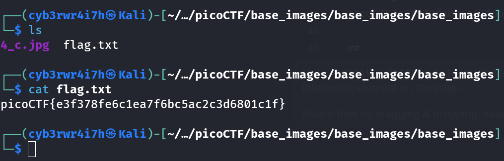

# Matryoshka doll
[Link](https://play.picoctf.org/practice/challenge/129?category=4&page=1) for this challenge
Points: 30

## Solution
Reading the challenge description, I felt there might be other file in the given image so I used `binwalk` tool


Then I unzipped this file using:
```bash
unzip doll.jpg
```
Then in unzipped data, I checked the `base_images` directory and found another image.


I repeated the same steps untill I found a file `flag.txt`
Then I printed it's content using `cat` command.



## Flag
picoCTF{e3f378fe6c1ea7f6bc5ac2c3d6801c1f}   
