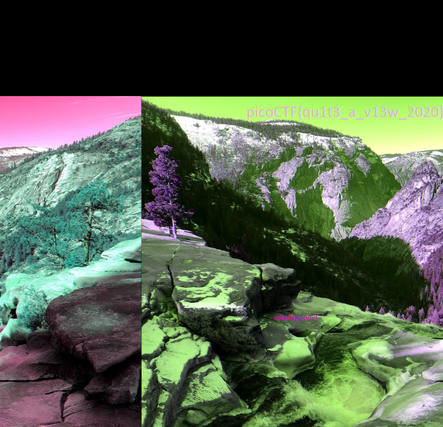

# tunn3l v1s10n
[Link](https://play.picoctf.org/practice/challenge/112?category=4&page=1) for this challenge

Points: 40

## Writeup
First I tried to see the filetype using `file` command but it didn't tell much so I used `xxd` tool to print the file headers
```bash
xxd tunn3l_v1s1on | head
```
(`head` command will print only the first 10 lines. I used it since I only need to see the file headers which are present in the first line)
This gave the output:


Here, the file headers looked like that of a `BMP` file. So I did a google search and then I stumbled upon [this](https://www.photopea.com) website which could display such files.
When I uploaded this file, I received:


There was no flag in this image. It just said `Notaflag(sorry)`
This looked like only a part of the image so I looked for ways to see the complete image. Then reading more about file headers I came across [this](https://en.wikipedia.org/wiki/BMP_file_format) wikipedia page. Here I found out that bitmap `height starts at offset 16` and `width starts at offset 12`. So I tried changing there values. When I changed the height bit to `4E 04` and uploaded the image to [this](https://www.photopea.com) website again, I got this image:



This image had the flag.

## Flag
picoCTF{qu1t3_a_v13w_2020}
