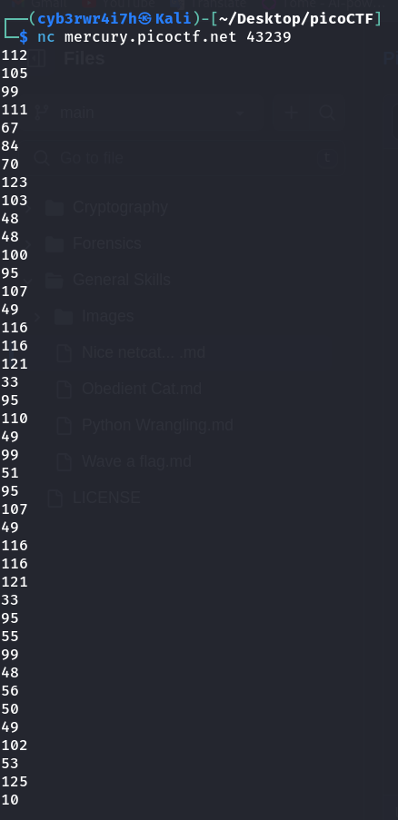

# Nice netcat...
[Link](https://play.picoctf.org/practice/challenge/156?category=5&page=1) for this challenge

Points: 15

## Writeup
The challenge provides a netcat command to connect to a remote service. Putting in the given `netcat` command in terminal, I got this sequence of numbers:



This sequence of numbers looked like ASCII codes. So, I tried to convert it into text using `perl` tool:
```bash
 perl -e '@a=(112,105,99,111,67,84,70,123,103,48,48,100,95,107,49,116,116,121,33,95,110,49,99,51,95,107,49,116,116,121,33,95,55,99,48,56,50,49,102,53,125,10); foreach(@a){print chr($_)}'
```
This gave out the flag.

## Flag
picoCTF{g00d_k1tty!_n1c3_k1tty!_7c0821f5}

## Extra
- To know more about `nc`, check out [this](https://manpages.org/nc) manpage
- For ASCII Codes, have a look at [this](https://www.ascii-code.com) website
- To know more about `perl`, check out [this](https://manpages.org/perl) manpage
