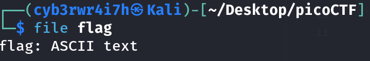
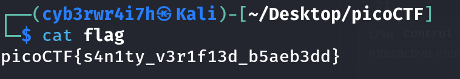

# Obedient Cat
[Link](https://play.picoctf.org/practice/challenge/147?category=5&page=1) for this challenge

Points: 5

# Writeup
First I checked the file type using `file` tool:
```bash
file flag
```


Since it's ASCII text, I simply printed it's content using `cat` command.
```bash
cat flag
```
This gave out the flag.


## Flag
picoCTF{s4n1ty_v3r1f13d_b5aeb3dd}
