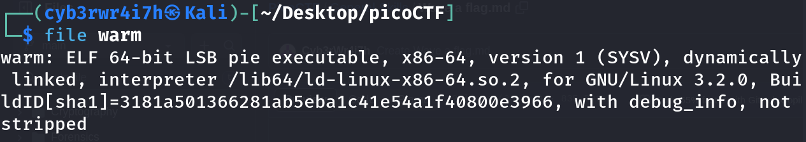

# Wave a flag
[Link](https://play.picoctf.org/practice/challenge/170?category=5&page=1) for this challenge

Points: 10

## Writeup
First I checked the filetype using `file` command.
```bash
file warm
```



This meant it is an executable program so I tried to execute it. For that, I gave the permission to execute it:
```bash
chmod +x warm
```

Then I ran this file:
```bash
./warm
```
This gave:


So, I passed it a `-h`:
```bash
./warm -h
```


Here I got the flag.

## Flag
picoCTF{b1scu1ts_4nd_gr4vy_755f3544}

## Extra
-To know more about the `file` command, check out [this](https://www.man7.org/linux/man-pages/man1/file.1.html) man page

-To know more about the `chmod` command, check out [this](https://man7.org/linux/man-pages/man1/chmod.1.html) man page
